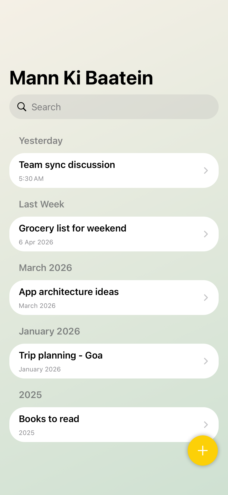
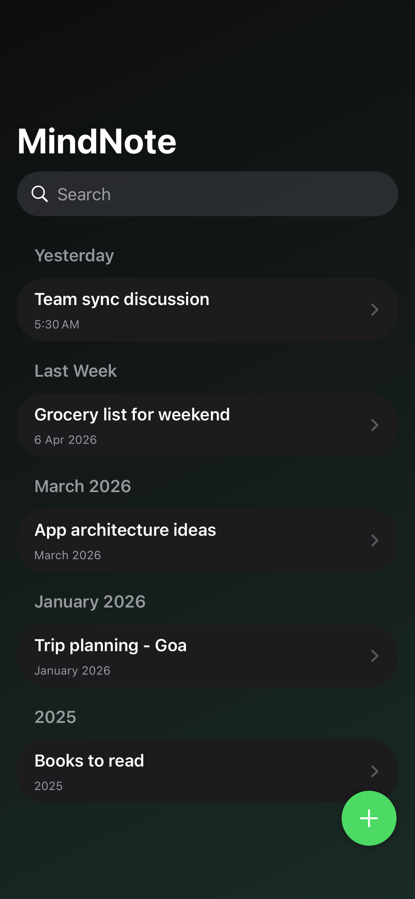
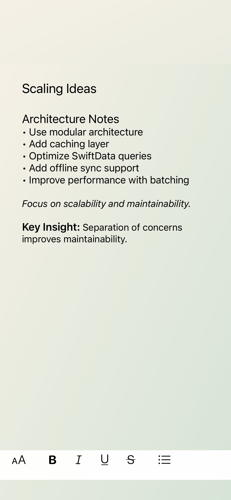
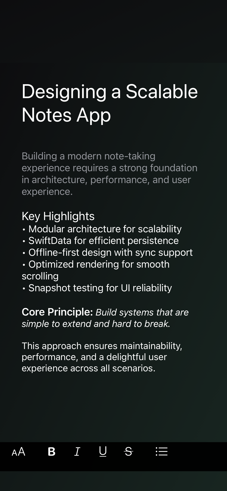
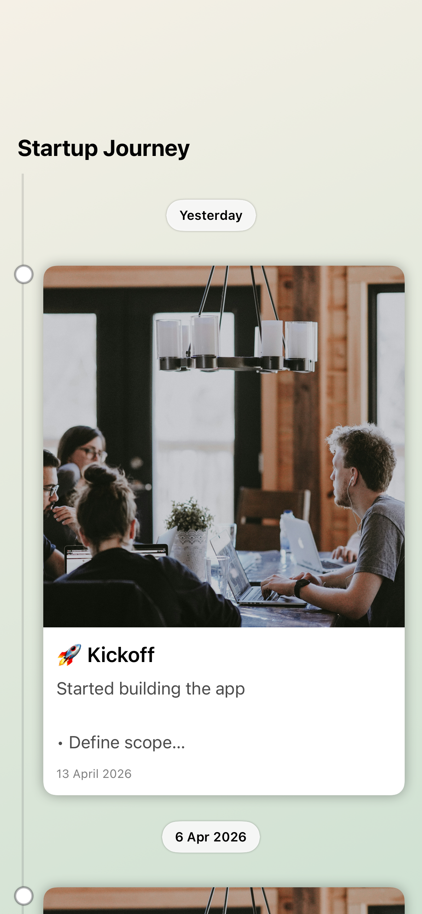
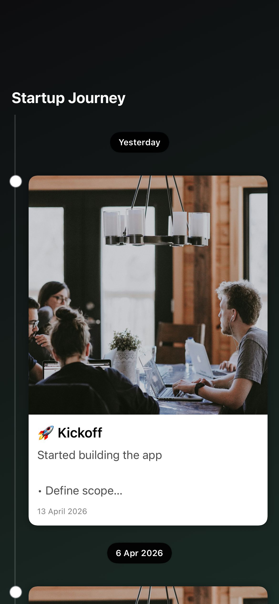
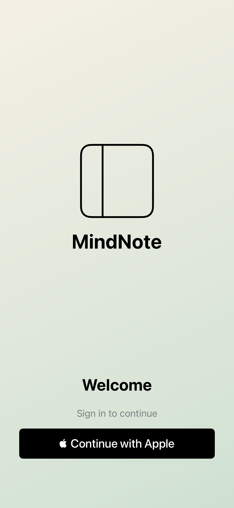
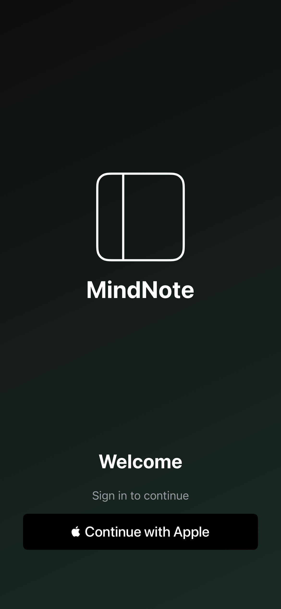

# 🧠 MindNote

---


---

## ✨ Why MindNote?

Most note-taking apps treat content as static text.

MindNote is built to change that.

It transforms notes into **living memories** — combining timeline-based storytelling, rich media, and thoughtful design.

Designed to be:
- ⚡ Fast
- 🎯 Intuitive
- 🧠 Thoughtful
- 🌙 Beautiful in both light & dark mode

---

## 🎯 Motivation

Most journaling or note apps are:
- Too cluttered 🧩
- Too plain 😴
- Or lack emotional context 🕰️

MindNote was built to solve this.

> Turn notes into moments you can revisit.

---

## ✨ Overview

**MindNote** is a modern, offline-first note-taking and memory journaling app designed to make personal content feel alive.

Instead of treating notes as static text, MindNote transforms them into **moments on a timeline** — combining rich text, media, and structured experiences.

---

## 🚀 Features

### 📝 Smart Notes
- Rich text editing (bold, italics, lists)
- Clean, distraction-free writing experience
- Seamless **SwiftUI + UIKit** integration

### 🕰️ Memory Lane
- Timeline-based journaling experience
- Grouped by **Today / Yesterday / Date**
- Attach images, locations, and detailed notes
- Designed to feel like **memories, not files**

### 🔐 Secure Access
- Face ID authentication
- Smooth onboarding flow

### 🎨 Dynamic Branding
- Multiple app flavors:
  - **MindNote** → Professional
  - **MannKiBaat** → Personalized
- Injected using environment-driven configuration

### 📸 Snapshot Testing
- Full UI regression coverage
- JSON-driven mock data
- Deterministic, CI-friendly (Xcode Cloud)

---


## 🏗️ Architecture

```
App
├── Features
│   ├── NotesFeature
│   ├── MemoryFeature
│   ├── LoginFeature
│
├── Core
│   ├── SharedModels (SwiftData)
│   ├── Branding (Environment-based)
│
├── UI
│   ├── SwiftUI Views
│   ├── UIKit Bridges
│
├── Testing
│   ├── Snapshot Tests
│   ├── JSON Mock Data
```

### Key Principles
- Modular feature isolation
- Clear separation of concerns
- Testable UI architecture
- Scalable data flow

---

## ⚙️ Tech Stack

- **SwiftUI** – Declarative UI
- **SwiftData** – Persistence layer
- **UIKit** – Rich text editor
- **Combine** – State management
- **SnapshotTesting** – UI regression

---

## 🧪 Snapshot Testing

MindNote uses **JSON-driven UI testing** to ensure consistency across builds.

```
JSON → DTO → SwiftData → UI → Snapshot
```

### Why it matters
- Prevents UI regressions
- Enables rapid iteration
- Works perfectly in CI environments

---

## 🎯 Highlights

- Hybrid **SwiftUI + UIKit** architecture
- Timeline-based UX (inspired by journaling apps)
- Environment-driven branding system
- Production-grade mock data pipeline
- Fully deterministic UI testing

---

## 🚀 Getting Started

```bash
git clone https://github.com/ipratikk/MannKiBaat.git
cd MannKiBaat
open MannKiBaat.xcodeproj
```

Run on:
- iOS Simulator
- Physical device

---

## 📦 Build Variants

| Variant        | Description                     |
|----------------|--------------------------------|
| MindNote       | Generic, professional version  |
| MannKiBaat     | Personalized experience        |

---

## 📸 Screenshots

### 📝 Notes
<table>
<tr>
<td></td>
<td></td>
</tr>
</table>

---

### ✍️ Editor
<table>
<tr>
<td></td>
<td></td>
</tr>
</table>

---

### 🕰️ Memory Lane
<table>
<tr>
<td></td>
<td></td>
</tr>
</table>

---

### 🔐 Authentication
<table>
<tr>
<td></td>
<td></td>
</tr>
</table>

---

> 📌 Screens are automatically generated via snapshot tests (Light & Dark mode)

---

## 💡 Inspiration

> Notes are not just text — they are moments in time.

---

## 👨‍💻 Author

**Pratik Goel**

---

## ⭐️ Support

If you like this project, consider giving it a star ⭐️
